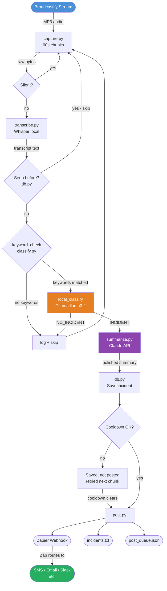

# Scanner Page

Automated pipeline: Broadcastify audio → Whisper STT → Ollama (local) → Claude polish → Zapier webhook.

Works with any Broadcastify feed. Configured by default for Chagrin Valley Dispatch.

## Data flow



## Quick start

```bash
# 1. Install system deps
brew install ffmpeg
brew install ollama && ollama pull llama3.2:3b

# 2. Python deps
cd scanner-page
python -m venv .venv && source .venv/bin/activate
pip install -r requirements.txt

# 3. Configure (copy and edit)
cp .env.example .env

# 4. Run (prints to console by default)
POST_BACKEND=print python main.py
```

## Configuration

All settings live in `.env`. Copy `.env.example` to get started:

| Variable | Default | Description |
|---|---|---|
| `BROADCASTIFY_FEED_URL` | Chagrin Valley feed | Full stream URL from Broadcastify |
| `COMMUNITY_NAME` | `Chagrin Valley` | Short name, used in logs |
| `COMMUNITY_DESC` | `Chagrin Falls and surrounding Cuyahoga County communities` | Used in Claude prompt |
| `ANTHROPIC_API_KEY` | — | Required for Claude polish step |
| `OLLAMA_MODEL` | `llama3.2:3b` | Local model for incident classification |
| `OLLAMA_URL` | `http://localhost:11434` | Ollama server address |
| `POST_BACKEND` | `queue` | `queue`, `text`, `zapier`, or `print` |
| `TEXT_OUTPUT_FILE` | `incidents.txt` | Output path for `text` backend |
| `ZAPIER_WEBHOOK_URL` | — | Catch Hook URL for `zapier` backend |

### Finding your Broadcastify stream URL

1. Go to broadcastify.com and find your feed
2. The feed ID is in the URL: `broadcastify.com/listen/feed/XXXXX`
3. Stream URL format: `https://broadcastify.cdnstream1.com/XXXXX`

### Example: configuring for a different community

```
BROADCASTIFY_FEED_URL=https://broadcastify.cdnstream1.com/99999
COMMUNITY_NAME=Akron Metro
COMMUNITY_DESC=Akron and surrounding Summit County communities
```

## Pipeline

```
stream → whisper (free, local)
       → keyword filter (free, instant)
       → ollama classify (free, local)
       → claude polish (API, ~pennies/month — only on confirmed incidents)
       → post/queue
```

## Backends

| `POST_BACKEND` | Behavior |
|---|---|
| `queue` (default) | Appends to `post_queue.json` for manual review |
| `text` | Appends formatted entries to `incidents.txt` (or `TEXT_OUTPUT_FILE`) |
| `zapier` | POSTs incident JSON to a Zapier Catch Hook URL |
| `print` | Prints formatted post to stdout |

### Zapier setup

1. In Zapier, create a new Zap → trigger: **Webhooks by Zapier → Catch Hook**
2. Copy the webhook URL
3. Set `ZAPIER_WEBHOOK_URL=<url>` in `.env`
4. Set `POST_BACKEND=zapier`

From there you can route to SMS, email, Slack, or anything else Zapier supports — no code changes needed.

The payload sent to Zapier for incidents:

```json
{
  "summary": "Structure Fire — 123 Main St — Engine 3 dispatched.",
  "type": "Structure Fire",
  "location": "123 Main St",
  "time": "14:32",
  "posted_at": "2026-05-12T14:32:00+00:00"
}
```

Stream alarms also POST to the same webhook with `"type": "stream_alarm"` so you can filter or route them separately in Zapier (e.g. send alarms to email, incidents to Facebook).

## Running as a background service (macOS)

The pipeline is designed to run continuously. Use launchd to keep it running automatically at login and restart it if it crashes.

### Install

```bash
# Copy the plist to LaunchAgents
cp com.billford.scanner.plist ~/Library/LaunchAgents/

# Load and start it
launchctl load ~/Library/LaunchAgents/com.billford.scanner.plist
```

### Common commands

```bash
# Check status (shows PID and last exit code)
launchctl list | grep scanner

# View live logs
tail -f ~/sdr-broadcast/scanner-page/scanner.log

# Stop
launchctl stop com.billford.scanner

# Start
launchctl start com.billford.scanner

# Remove completely (won't restart on login)
launchctl unload ~/Library/LaunchAgents/com.billford.scanner.plist
```

Logs go to `scanner.log` in the project directory. The service auto-restarts with a 30-second throttle if it crashes repeatedly.

## Whisper backend

| `WHISPER_BACKEND` | Behavior |
|---|---|
| `local` (default) | Uses `openai-whisper` package locally (free, ~150 MB model download) |
| `openai` | Uses OpenAI Whisper API (requires `OPENAI_API_KEY`) |

## Files

| File | Purpose |
|---|---|
| `main.py` | Main loop |
| `capture.py` | Broadcastify stream capture + silence detection |
| `transcribe.py` | Whisper transcription |
| `classify.py` | Keyword pre-filter + Ollama local classification |
| `summarize.py` | Claude API polish step |
| `post.py` | Zapier / text / queue posting |
| `db.py` | SQLite incident log + dedup |
| `config.py` | All configuration |

## Stream resilience

When a Broadcastify feed goes offline (feeder down, etc.) the pipeline:

1. Retries quickly — 5s, 10s, 20s — to recover from brief dropouts
2. After 3 consecutive failures, fires a **stream-down alarm**: macOS notification (Sosumi sound) + Zapier webhook with `type: stream_alarm`
3. Switches to a **10-minute retry interval** to keep logs quiet until the feed recovers
4. Logs `"Stream reconnected — clearing alarm"` and resets when the feed comes back

Broadcastify 404 "Not Available" means the feeder is offline — it is not a payment or authentication issue. Both Cleveland feeds are free (`isPremium: false`).

## Post cooldown

`POST_COOLDOWN_MINUTES` (default: 5) prevents duplicate posts for the same incident type in a short window. Incidents blocked by the cooldown are **saved to the DB** and automatically posted once the cooldown clears — nothing is dropped.

## Notes

- `ffmpeg` is required by openai-whisper for MP3 decoding.
- Incidents are always saved to `incidents.db` regardless of backend.
- Review `post_queue.json` to approve posts before going live.
- The Whisper `base.en` model is English-only and fast. Use `base` for multilingual feeds.
